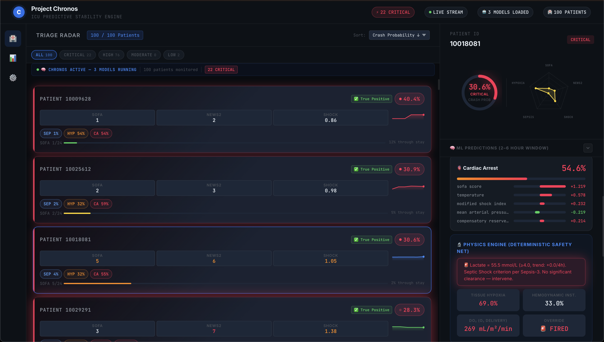

# Project Chronos

Predictive ICU Early Warning System


An on-premise, AI-powered clinical decision support system that predicts three critical ICU events 2-6 hours before onset, using a multi-engine machine learning ensemble, a deterministic physics-based safety net, and multi-agent LLM clinical reasoning.



---

## Table of Contents

- [Overview](#overview)
- [Clinical Problem](#clinical-problem)
- [System Architecture](#system-architecture)
- [Prediction Targets and Performance](#prediction-targets-and-performance)
- [Machine Learning Pipeline](#machine-learning-pipeline)
- [Physics Engine](#physics-engine)
- [Multi-Agent Clinical Debate](#multi-agent-clinical-debate)
- [Feature Engineering](#feature-engineering)
- [Datasets](#datasets)
- [Getting Started](#getting-started)
- [Project Structure](#project-structure)
- [Configuration](#configuration)
- [Known Limitations](#known-limitations)
- [References](#references)
- [License](#license)

---

## Overview

Project Chronos is an end-to-end ICU early warning system designed to run entirely on local hardware with no cloud dependencies. Patient data never leaves the hospital network, maintaining HIPAA compliance by architecture rather than policy.

The system processes streaming patient vitals, runs them through a 4-engine ML ensemble with SHAP-based explainability, validates predictions against a deterministic physics model grounded in human physiology, and optionally augments clinical interpretation through a multi-agent LLM debate using a locally-hosted medical language model.

**Key characteristics:**

- Predicts septic shock, acute hypotensive episodes, and hemodynamic collapse
- 2-6 hour advance warning window
- SHAP feature importance for every prediction, every patient
- Runs on a single 24 GB Apple Silicon Mac (tested on M4)
- Real-time WebSocket streaming to a React-based triage dashboard

---

## Clinical Problem

ICU monitoring systems generate an average of 187 alarms per patient per day, of which up to 99% are clinically non-actionable (Sendelbach and Funk, AACN Advanced Critical Care, 2013). This volume creates alarm fatigue: clinicians become desensitized and miss genuine deterioration events. Meanwhile, early recognition of sepsis reduces mortality by approximately 7.6% per hour of earlier treatment (Kumar et al., Critical Care Medicine, 2006).

Existing clinical scoring systems (NEWS2, qSOFA, APACHE IV) are calculated at fixed intervals, rely on manual data entry, and cannot capture temporal trends in high-frequency vital sign data. Commercial AI systems such as the Epic Sepsis Model have demonstrated limited discrimination (AUROC 0.63 in external validation; Wong et al., JAMA Internal Medicine, 2021).

Project Chronos addresses this gap through continuous, automated prediction with three layers of validation.

---

## System Architecture

```text
                                    Project Chronos
    ┌────────────────────────────────────────────────────────────────────┐
    │                                                                    │
    │   Patient Vitals Stream                                            │
    │         │                                                          │
    │         ▼                                                          │
    │   ┌─────────────┐                                                  │
    │   │ Feature     │  70 engineered features                          │
    │   │ Engineering │  8 lab missingness flags                         │
    │   │ Pipeline    │  12 clinical composite scores                    │
    │   └──────┬──────┘  35 temporal deltas                              │
    │          │                                                         │
    │          ├──────────────────────────────────────┐                  │
    │          ▼                                      ▼                  │
    │   ┌─────────────────────┐          ┌──────────────────────┐        │
    │   │   ML Ensemble       │          │   Physics Engine     │        │
    │   │                     │          │                      │        │
    │   │  LightGBM           │          │  Fick's Principle    │        │
    │   │  XGBoost            │          │  O2 Delivery (DO2)   │        │
    │   │  GRU-D (temporal)   │          │  Tissue Hypoxia Idx  │        │
    │   │  TCN  (temporal)    │          │  Hemodynamic Score   │        │
    │   │       │             │          │  Trajectory-Gated    │        │
    │   │       ▼             │          │  Override System     │        │
    │   │  Meta-Stacker       │          └──────────┬───────────┘        │
    │   │  (LightGBM)         │                     │                    │
    │   │       │             │                     │                    │
    │   │       ▼             │                     │                    │
    │   │  Isotonic           │                     │                    │
    │   │  Calibration        │                     │                    │
    │   └──────┬──────────────┘                     │                    │
    │          │                                    │                    │
    │          └────────────────┬───────────────────┘                    │
    │                           ▼                                        │
    │                    ┌─────────────┐                                 │
    │                    │  Risk Score │                                 │
    │                    │  + SHAP     │                                 │
    │                    │  + Alerts   │                                 │
    │                    └──────┬──────┘                                 │
    │                           │                                        │
    │                           ▼                                        │
    │                    ┌─────────────┐       ┌──────────────────┐      │
    │                    │  FastAPI    │       │  Ollama (Local)  │      │
    │                    │  + WS       │◄─────►│  Med42-v2 8B     │      │
    │                    └──────┬──────┘       │  Clinical LLM    │      │
    │                           │              └──────────────────┘      │
    │                           ▼                                        │
    │                    ┌─────────────┐                                 │
    │                    │  React      │                                 │
    │                    │  Triage     │                                 │
    │                    │  Dashboard  │                                 │
    │                    └─────────────┘                                 │
    └────────────────────────────────────────────────────────────────────┘
```

The backend is built with FastAPI (Python 3.12) and serves predictions via both REST endpoints and a WebSocket connection for real-time streaming. The frontend is a React application built with Vite, designed for dark-mode ICU workstation displays.

---

## Prediction Targets and Performance

All models were trained using 5-fold StratifiedGroupKFold cross-validation with patient-level grouping to prevent data leakage. Thresholds are optimized using F-beta=2 (sensitivity-weighted) to prioritize early detection over precision in the ICU context.

### Results

| Target | Test AUROC | Test AUPRC | Sensitivity | Specificity | vs NEWS2 Baseline |
| ------ | ---------- | ---------- | ----------- | ----------- | ----------------- |
| Septic Shock | 0.718 | 0.085 | 0.778 | 0.357 | +5.3% |
| **Blood Pressure Collapse** | **0.942** | **0.458** | **0.888** | **0.880** | **+27.7%** |
| Hemodynamic Collapse | 0.680 | 0.043 | 0.155 | 0.984 | -5.3% |

### Context

- The **blood pressure collapse** model (AUROC 0.942) significantly outperforms the Epic Sepsis Model (AUROC 0.63; Wong et al., JAMA Internal Medicine, 2021, n=38,455) and the NEWS2 clinical score on hypotension detection.
- The **sepsis** model runs with 3 of 4 engines (TCN excluded from this training run due to numerical instability). Performance is expected to improve with the full ensemble.
- The **hemodynamic collapse** model underperforms NEWS2, primarily due to proxy labeling from surgical data (see [Known Limitations](#known-limitations)).

---

## Machine Learning Pipeline

### Engine Architecture

| Engine | Type | Input | Imbalance Handling | Purpose |
| ------ | ---- | ----- | ------------------ | ------- |
| LightGBM | Gradient boosting | 70 tabular features | Native class weighting | Primary tabular learner |
| XGBoost | Gradient boosting | 70 tabular features | scale_pos_weight | Complementary tabular learner |
| GRU-D | Recurrent neural network | Sequences with mask + delta channels | Focal BCE (gamma=2.0) | Temporal patterns with learned missingness decay |
| TCN | Temporal convolutional network | Sequences with mask + delta channels | Focal BCE (gamma=2.0) | Long-range temporal dependencies via dilated causal convolutions |

### Pipeline Stages

1. **Per-patient feature engineering** (70 features, computed within each patient to prevent cross-patient leakage)
2. **Patient-level train/test split** (GroupShuffleSplit, 80/20, grouped by patient ID)
3. **Optuna hyperparameter tuning** for LightGBM and XGBoost (50 trials each)
4. **5-fold StratifiedGroupKFold** training with out-of-fold predictions
5. **LightGBM meta-stacker** trained on concatenated out-of-fold predictions (learns when each engine is more accurate)
6. **Isotonic calibration** for clinically meaningful probability estimates
7. **F-beta=2 threshold optimization** on the development set

### Sequential Models

**GRU-D** implements the architecture from Che et al. (Scientific Reports, 2018), which modifies standard GRU cells with trainable decay rates for handling irregular time-series with missing values. Input channels are `[values, missingness_mask, time_since_last_observation]`.

**TCN** uses 6 levels of dilated causal convolutions with an effective receptive field of 252 time steps. Architecture includes weight-normalized Conv1d layers, GroupNorm, and residual connections. Input structure mirrors GRU-D with 3x multiplied channels.

Both sequential models use per-target sequence lengths: 12 hours for sepsis and hypotension, 8 hours for hemodynamic collapse (adjusted for shorter surgical case durations in VitalDB).

---

## Physics Engine

The physics engine is a deterministic, non-ML physiological model that runs in parallel with the ML ensemble. It computes hemodynamic stability scores from fundamental biological principles and acts as a safety net: if the physics model detects imminent biological failure, it triggers an alert regardless of ML confidence.

### Mathematical Foundations

**Arterial Oxygen Content** (Hufner, 1894):

```text
CaO2 = (Hb x 1.34 x SaO2) + (0.0031 x PaO2)
```

**Oxygen Delivery** (Fick, 1870):

```text
DO2 = CO x CaO2 x 10 / BSA
```

Where cardiac output (CO) is estimated from heart rate and pulse pressure, and body surface area (BSA) uses the Mosteller formula (NEJM, 1987).

**Temperature-Adjusted VO2** (van't Hoff approximation):

```text
VO2 = 250 x (1.10 ^ (T - 37.0))
```

Every degree Celsius above 37.0 increases metabolic oxygen demand by approximately 10%, following the Q10 rule (Sessler, Anesthesiology, 2016).

### Computed Indices

| Index | Range | Interpretation |
| ----- | ----- | -------------- |
| Tissue Hypoxia Index (THI) | 0.0 - 1.0 | Weighted combination of DO2 deficit, lactate elevation, and MAP deficit |
| Hemodynamic Instability Score (HIS) | 0.0 - 1.0 | Shock Index thresholds, MAP, tachycardia, temporal trajectory, vasopressor dependence |
| Combined Probability | 0 - 100% | 60% THI + 40% HIS |

### Trajectory-Gated Override System

A critical design choice: physics overrides are **trajectory-gated**. A point-in-time threshold breach alone does not trigger an alert. The system checks whether the patient's trend is improving before firing:

- A patient whose MAP dropped to 52 mmHg but is now at 68 mmHg and rising: **no override** (recovering).
- A patient whose MAP is at 52 mmHg and has not improved over 4 hours: **override fires** (deteriorating).

This design directly addresses alarm fatigue by suppressing alerts for transient events that resolve with treatment. Override triggers include:

| Condition | Threshold | Trajectory Gate |
| --------- | --------- | --------------- |
| Critical O2 delivery failure | DO2 < 250 mL/min/m2 | Always fires (no time to recover) |
| Severe lactate | Lactate > 4.0 mmol/L (Sepsis-3) | Only if not clearing (delta > -0.5/4h) |
| Refractory hypotension | MAP < 65 mmHg on vasopressors | Only if MAP not improving (+5 mmHg/4h) |
| Tissue hypoxia cascade | THI > 0.80 | Always fires |

Clinical references: Surviving Sepsis Campaign (Dellinger et al., Critical Care Medicine, 2013), Sepsis-3 (Singer et al., JAMA, 2016), Guyton and Hall Textbook of Medical Physiology, 14th Edition (Hall, 2021).

---

## Multi-Agent Clinical Debate

When a local LLM is available (via Ollama), the system runs a multi-agent clinical debate for each selected patient. Three AI agents analyze the same patient data from different clinical perspectives:

| Agent | Perspective | Clinical Role |
| ----- | ----------- | ------------- |
| Dr. Hawkeye | Aggressive | Identifies the most dangerous finding and argues for immediate intervention |
| Dr. Reed | Conservative | Identifies what the data does NOT show and argues against premature escalation |
| Dr. Foreman | Differential | Challenges the primary assessment and proposes alternative diagnoses |

Each agent receives the complete patient context: all prediction scores with risk levels, clinical composite scores with reference ranges, current vitals with units, SHAP feature drivers for all three predictions, and physics engine outputs.

**Anti-hallucination controls**: Each agent operates under strict rules prohibiting fabrication of symptoms, medications, lab values, or clinical events not present in the provided data. Agents must reference specific numerical values and explicitly flag unavailable data points.

The clinical debate is implemented using Med42-v2 8B (Christophe et al., M42 Health, 2024), a Llama-3 fine-tune trained for clinical reasoning, running locally through Ollama. No patient data is transmitted to external servers.

> **Note**: The LLM debate is a computational analysis tool. The system displays an explicit disclaimer: clinical decisions belong to the treating physician.

---

## Feature Engineering

The feature pipeline produces 70 engineered features from raw vital signs and lab values.

### Feature Categories

| Category | Count | Description |
| -------- | ----- | ----------- |
| Base vitals | 15 | HR, SBP, DBP, MAP, SpO2, RR, Temp, Lactate, WBC, Creatinine, Bilirubin, Platelets, PaO2, FiO2, GCS |
| Lab missingness flags | 8 | Binary indicators for whether each lab test was ordered at each time step |
| Clinical composite scores | 12 | SOFA, NEWS2, Shock Index, MAP/Lactate ratio, PF ratio, Rate-Pressure Product, DO2, A-a gradient, CRI, SOFA delta flags |
| Temporal deltas | 35 | 7 key vitals x 5 windows (1h, 2h, 4h lookback, plus rolling mean/std) |

### Lab Missingness as a Feature

A deliberately ordered lab test reflects clinical suspicion. A lactate test not ordered at 02:00 suggests the clinician did not suspect tissue hypoperfusion at that time. This absence is itself a predictive signal.

The pipeline adds binary **missingness flags** (e.g., `lactate_measured`, `wbc_measured`) *before* imputation, preserving the informational content of the ordering decision. After flags are recorded, missing values are forward-filled within each patient and then filled with population-median fallback values for downstream computation.

This approach is supported by Agniel et al. (Science Translational Medicine, 2018), who demonstrated that missingness indicators account for a substantial fraction of top predictors in ICU outcome models.

### Imputation Strategy

| Data Type | Strategy | Rationale |
| --------- | -------- | --------- |
| Monitor vitals (HR, SpO2, etc.) | Forward-fill only | Continuous measurements; last-known value is clinically appropriate |
| Lab values (Lactate, WBC, etc.) | Missingness flag, then forward-fill, then population median | Intermittent measurements; ordering patterns carry clinical information |
| Temporal deltas | Computed from raw values before imputation, NaN filled with 0.0 | Prevents artificial trends from imputed-to-real value transitions |

### Clinical Composite Scores

All composite scores are implemented from published clinical definitions:

- **SOFA**: Sequential Organ Failure Assessment (Singer et al., JAMA, 2016)
- **NEWS2**: National Early Warning Score 2 (Royal College of Physicians, 2017)
- **Shock Index**: HR / SBP (Allgower and Burri, 1967)
- **PF Ratio**: PaO2 / FiO2 (Berlin Definition, ARDS; JAMA, 2012)
- **A-a Gradient**: (FiO2 x 713) - (PaCO2 / 0.8) - PaO2

---

## Datasets

All datasets are publicly available. No proprietary or restricted-access clinical data is used.

| Dataset | Source | Patients/Records | Target | Label Quality |
| ------- | ------ | ----------------- | ------ | ------------- |
| PhysioNet CinC 2019 | physionet.org | 40,336 | Sepsis | Gold standard (SepsisLabel) |
| eICU Collaborative Demo | physionet.org | 2,520 ICU stays | Hypotension | MAP-based AHE labels |
| VitalDB | vitaldb.net | 6,389 surgical cases | Hemodynamic Collapse | Proxy (MAP<50 5min or SpO2<85 3min) |
| Zenodo Cardiac | zenodo.org | 112 arrests | Hemodynamic Collapse | Real outcome labels |
| CUDB (Creighton University) | physionet.org | 35 records | Hemodynamic Collapse | VF onset annotated |
| SDDB (Sudden Cardiac Death) | physionet.org | 23 Holter records | Hemodynamic Collapse | Sudden death annotated |
| MIMIC-III Demo | physionet.org | 100 patients | Shadow evaluation | Not used for training |
| MIMIC-IV Demo | physionet.org | 100 patients | Shadow evaluation | Not used for training |

### Download Instructions

```bash
cd backend
source .venv/bin/activate
python scripts/download_datasets.py --all
```

Individual dataset downloads are also supported:

```bash
python scripts/download_datasets.py --cinc2019
python scripts/download_datasets.py --eicu
python scripts/download_datasets.py --vitaldb
```

Dataset preparation (label generation, format normalization):

```bash
python scripts/prepare_datasets.py --all
```

### Directory Structure

After downloading, the `backend/data/` directory should have the following layout:

```text
backend/data/
├── cinc2019/                          # PhysioNet Computing in Cardiology 2019
│   ├── training_setA/                 # 20,336 patients (.psv files)
│   └── training_setB/                 # 20,000 patients (.psv files)
├── eicu_demo/                         # eICU Collaborative Research Database (Demo)
│   ├── patient.csv
│   ├── vitalPeriodic.csv
│   ├── vitalAperiodic.csv
│   ├── lab.csv
│   ├── infusionDrug.csv
│   └── ...                            # Additional eICU CSV tables
├── vitaldb/                           # VitalDB Open Dataset
│   └── *.vital                        # 6,389 surgical case files
├── zenodo_cardiac/                    # Zenodo Cardiac Arrest (Sri Lanka)
│   └── CardiacPatientData.csv         # 112 cardiac arrest records
├── cudb_ventricular_tachyarrhythmia/  # Creighton University VT Database
│   └── *.dat, *.hea, *.atr            # 35 WFDB-format ECG records
├── sddb_sudden_cardiac/               # Sudden Cardiac Death Holter Database
│   └── *.dat, *.hea, *.atr            # 23 WFDB-format Holter records
├── cinc2009_hypotension/              # CinC 2009 Hypotension Challenge
│   └── *.txt                          # Waveform records
├── mimic3_demo/                       # MIMIC-III Clinical Database (Demo)
│   └── *.csv                          # 100 patients (shadow evaluation only)
├── mimic4_demo/                       # MIMIC-IV Clinical Database (Demo)
│   └── hosp/, icu/                    # 100 patients (shadow evaluation only)
├── icare/                             # I-CARE Dataset (PhysioNet 2.1)
│   └── ...                            # 1,020 post-cardiac-arrest patients
├── uq_vital_signs/                    # UQ Vital Signs Dataset
│   └── uqvitalsignsdata/              # Processed vital sign records
├── kaggle_supplements/                # Kaggle Supplement Datasets
│   └── sepsis_survival_clinical/      # Clinical deterioration dataset
└── reference_notebooks/               # Reference Jupyter notebooks
```

Note: Not all datasets are required for training. The minimum required datasets per target are:

| Target | Required Dataset | Directory |
| ------ | ---------------- | --------- |
| Sepsis | PhysioNet CinC 2019 | `cinc2019/` |
| Hypotension | eICU Collaborative Demo | `eicu_demo/` |
| Hemodynamic Collapse | VitalDB + Zenodo + CUDB + SDDB | `vitaldb/`, `zenodo_cardiac/`, `cudb_*`, `sddb_*` |

---

## Getting Started

### Prerequisites

- Python 3.12+
- Node.js 18+
- Apple Silicon Mac with 16+ GB RAM (tested on 24 GB M4)
- Ollama (optional, for multi-agent clinical debate)

### Backend Setup

```bash
cd backend
python3 -m venv .venv
source .venv/bin/activate
pip install -r requirements.txt

# Start the API server
uvicorn api:app --host 0.0.0.0 --port 8000 --reload
```

### Data Streamer

In a separate terminal:

```bash
cd backend
source .venv/bin/activate
python data_streamer.py --patients 20 --speed 5
```

### Frontend Setup

In a separate terminal:

```bash
cd frontend
npm install
npm run dev
```

The dashboard will be available at `http://localhost:5173/`.

### LLM Setup (Optional)

```bash
# Install Ollama (macOS)
brew install ollama

# Start Ollama server
ollama serve

# Pull the medical LLM (in another terminal)
ollama pull thewindmom/llama3-med42-8b
```

### Training Models (Optional)

Pre-trained model artifacts are included in `backend/models/`. To retrain:

```bash
cd backend
source .venv/bin/activate

# Download datasets first
python scripts/download_datasets.py --all
python scripts/prepare_datasets.py --all

# Train all targets
python train_models.py --all --tune

# Train a specific target
python train_models.py --target sepsis --tune
python train_models.py --target hypotension --tune
python train_models.py --target hemodynamic_collapse --tune
```

Training time is approximately 19 hours on a 24 GB M4 Mac for all three targets with Optuna hyperparameter tuning.

---

## Project Structure

```text
project-chronos/
├── backend/
│   ├── api.py                      # FastAPI server (REST + WebSocket)
│   ├── train_models.py             # Full training pipeline (4 engines, meta-stacker)
│   ├── features.py                 # 70-feature engineering pipeline
│   ├── physics_engine.py           # Deterministic physiological model
│   ├── data_streamer.py            # MIMIC-based ICU simulation streamer
│   ├── models/
│   │   ├── sepsis/                 # Trained model artifacts
│   │   ├── hypotension/            # Trained model artifacts
│   │   └── hemodynamic_collapse/   # Trained model artifacts
│   ├── scripts/
│   │   ├── download_datasets.py    # Dataset download automation
│   │   ├── prepare_datasets.py     # Label generation and normalization
│   │   └── shadow_evaluate.py      # Prospective shadow evaluation
│   ├── data/                       # Downloaded datasets
│   ├── logs/                       # Training logs
│   ├── COMMANDS.sh                 # Complete command reference
│   ├── PROJECT_HANDOFF.md          # Architecture and design decisions
│   └── .env.example                # Environment variable template
├── frontend/
│   ├── src/
│   │   ├── App.jsx                 # Main application with routing
│   │   ├── index.css               # Design system and component styles
│   │   ├── hooks/
│   │   │   └── useChronos.js       # WebSocket + REST data hook
│   │   └── components/
│   │       ├── PatientCard.jsx     # Triage radar patient card
│   │       ├── DetailPanel.jsx     # Patient detail with SHAP bars
│   │       ├── HouseTeam.jsx       # Multi-agent LLM debate panel
│   │       ├── AnalyticsDashboard.jsx  # Population analytics view
│   │       ├── SettingsPanel.jsx   # System configuration
│   │       └── Charts.jsx         # Shared chart components
│   └── .env                       # Frontend environment (API URL)
├── shared/
│   └── data_contract.py           # Pydantic API schema (backend-frontend contract)
├── assets/
│   └── dashboard_triage_radar.png  # Dashboard screenshot
├── docs/
│   ├── ARCHITECTURE.md            # Detailed technical architecture
│   └── MODEL_CARD.md              # Model card with known limitations
└── .gitignore
```

---

## Configuration

### Backend Environment Variables

| Variable | Default | Description |
| -------- | ------- | ----------- |
| `HOST` | `0.0.0.0` | API server bind address |
| `PORT` | `8000` | API server port |
| `MODELS_DIR` | `./models` | Path to trained model artifacts |

### Frontend Environment Variables

| Variable | Default | Description |
| -------- | ------- | ----------- |
| `VITE_API_URL` | `http://localhost:8000` | Backend API URL |

---

## Known Limitations

1. **Hemodynamic collapse model performance**: The hemodynamic collapse model (AUROC 0.680) underperforms the NEWS2 baseline. This is primarily due to proxy labeling: VitalDB provides surgical cases where labels are derived from MAP and SpO2 threshold breaches, which represent the output of circulatory failure rather than the precursor state the model is designed to predict. The Zenodo, CUDB, and SDDB datasets contribute real cardiac event labels but are too small (170 total events) to dominate the training signal.

2. **Cardiac output estimation**: The physics engine estimates cardiac output from heart rate and pulse pressure, which is a heuristic approximation. True cardiac output requires invasive measurement (Swan-Ganz catheter or thermodilution). In patients with conditions such as septic cardiomyopathy, this heuristic may be inaccurate.

3. **TCN training stability**: The TCN model experienced numerical instability (NaN loss) during training on the sepsis and hypotension datasets. Thirteen defensive mechanisms have been implemented (gradient clipping, NaN batch skipping, input BatchNorm, GroupNorm, etc.) but have not yet been validated in a full retraining run. The sepsis model currently runs with 3 of 4 engines.

4. **Retrospective evaluation only**: All performance metrics are from retrospective evaluation on held-out test sets. No prospective clinical validation has been conducted. The dashboard includes a simulation disclaimer on the analytics view.

5. **Patient identification**: The current system uses numeric patient IDs. Clinical deployment would require integration with hospital EMR systems for patient name, bed number, and demographic information.

6. **Alert acknowledgment**: The system does not currently include an alert acknowledgment workflow (mark as reviewed/actioned). This is required for clinical deployment to prevent alarm fatigue and maintain audit trails.

---

## References

1. Kumar V, et al. Duration of hypotension before initiation of effective antimicrobial therapy is the critical determinant of survival in human septic shock. *Critical Care Medicine*. 2006;34(6):1589-1596.

2. Singer M, et al. The Third International Consensus Definitions for Sepsis and Septic Shock (Sepsis-3). *JAMA*. 2016;315(8):801-810.

3. Wong A, et al. External Validation of a Widely Implemented Proprietary Sepsis Prediction Model in Hospitalized Patients. *JAMA Internal Medicine*. 2021;181(8):1065-1070.

4. Sendelbach S, Funk M. Alarm Fatigue: A Patient Safety Concern. *AACN Advanced Critical Care*. 2013;24(4):378-386.

5. Che Z, et al. Recurrent Neural Networks for Multivariate Time Series with Missing Values. *Scientific Reports*. 2018;8:6085.

6. Hall JE. *Guyton and Hall Textbook of Medical Physiology*. 14th ed. Elsevier; 2021.

7. Royal College of Physicians. *National Early Warning Score (NEWS) 2*. 2017.

8. Mosteller RD. Simplified Calculation of Body-Surface Area. *New England Journal of Medicine*. 1987;317(17):1098.

9. Sessler DI. Perioperative Thermoregulation and Heat Balance. *Anesthesiology*. 2016;124(3):614-620.

10. Agniel D, et al. Biases in electronic health record data due to processes within the healthcare system: retrospective observational study. *BMJ*. 2018;361:k1479.

11. Christophe C, et al. Med42-v2: A Suite of Clinical LLMs. *arXiv preprint*. 2024. arXiv:2408.06142.

12. Dellinger RP, et al. Surviving Sepsis Campaign: International Guidelines for Management of Severe Sepsis and Septic Shock: 2012. *Critical Care Medicine*. 2013;41(2):580-637.

---

## License

This project is licensed under the [GNU Affero General Public License v3.0](LICENSE). This means you are free to use, modify, and distribute this software, provided that:

- Any derivative work is also licensed under AGPL-3.0
- Original author attribution is preserved in all copies and derivatives
- If you deploy a modified version as a network service, you must make the source code available to users of that service

All datasets used are publicly available under their respective licenses (PhysioNet Open Data Use Agreements, Creative Commons).
